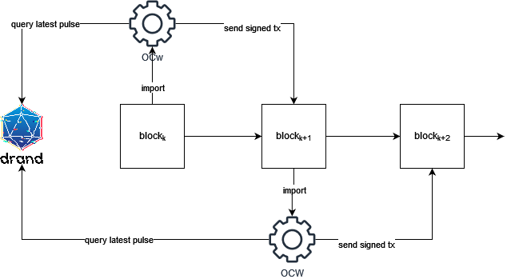

# How it Works

This document describes how the drand bridge pallet works.

## Overview

Drand's quicknet periodically outputs pulses of verifiable randomness every 3 seconds. There are various API's which provide access to the beacon, with this pallet simply using the main `api.drand.sh` URI. This pallet runs an offchain worker, which executes each time a node imports a new (*not* finalized) block. 

### Assumption and Limitations

1. in this initial version of the pallet we assume that the implementer is using a forkless block authoring mechanism, Isuch as Aura. Since we just use an offchain worker to read from drand, forks in the chain would result in divergent chains of randomness, which we must avoid.

2. Currently OCWs are at the will of the client’s “major sync oracle”, which means OCWs will not execute if the node is undergoing a “major sync” event. [ref]

3. It only supports drand’s quicknet, and so there is some trust placed in drand that they will retain liveness and that the league of entropy is not compromised. 

## Reading Pulses

The pallet attempts to read a fresh pulse of randomness from drand with each new block that is imported. We provide a 2 second window in which the OCW awaits a response from drand (this time must be less than the time allotted for block authorship). The OCW attempts to deserialize the response body to a struct. If valid, an signed transaction is constructed with the new struct being the payload. The runtime then verifies the new pulse before adding it to storage.

## Storing Pulses

Pulses are stored in a bounded storage value with a configurable max size of `MaxPulses`. In this initial implementation, we simply stop writing to storage when the limit is exceeded. In the future, we will write the pulses to a Merkle DAG which will allow for easy archival (and recovery) of pulses.

## Verifying Pulses

> Drand's Quicknet functions as a distributed, MPC protocol that produces and gossips threshold BLS signatures. In this flavor of drand, short signatures are used where the signature is in the $\mathbb{G}_1$ group and public keys are in $\mathbb{G}_2$. 

To verify pulses from drand, we check the equality of the pairings: $e(-sig, g2) == e(m, pk)$  where $m = H(message = Sha256(round))$, $sig$ is the round signature, $g_2$ is a generator of the $\mathbb{G}_2$ group, and $pk$ in the public key associated with the beacon.
